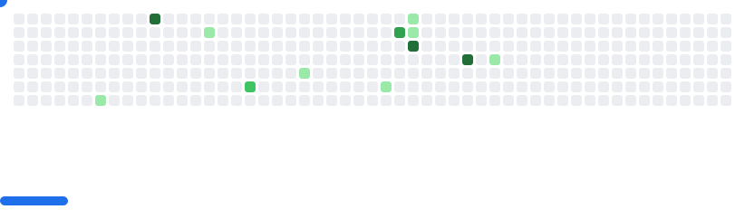

[](https://git.io/typing-svg)

<br />
<br />
<br />

<div align="center"> 

---

<!-- README-STATS:START -->

```
🕰️ I get my jam on during the daytime!

🌞 Morning  	245    commits	██████░░░░░░░░░░░░░░░░░░░░░░░░	8.51%
🌆 Daytime  	1205   commits	██████████████████████████████	41.87%
🌃 Evening  	628    commits	███████████████░░░░░░░░░░░░░░░	21.82%
🌙 Night    	800    commits	███████████████████░░░░░░░░░░░	27.80%
```

```
📅 I'm most productive on Wednesdays!

Monday      	343    commits	██████████████████░░░░░░░░░░░░	11.92%
Tuesday     	447    commits	███████████████████████░░░░░░░	15.53%
Wednesday   	566    commits	██████████████████████████████	19.67%
Thursday    	419    commits	██████████████████████░░░░░░░░	14.56%
Friday      	428    commits	██████████████████████░░░░░░░░	14.87%
Saturday    	355    commits	██████████████████░░░░░░░░░░░░	12.33%
Sunday      	320    commits	████████████████░░░░░░░░░░░░░░	11.12%
```

```
🧪 JavaScript for the win!

JavaScript  	72     repos	██████████████████████████████	24.08%
TypeScript  	56     repos	███████████████████████░░░░░░░	18.73%
CSS         	53     repos	██████████████████████░░░░░░░░	17.73%
HTML        	45     repos	██████████████████░░░░░░░░░░░░	15.05%
Shell       	14     repos	█████░░░░░░░░░░░░░░░░░░░░░░░░░	4.68%
```

<!-- README-STATS:END -->

---

### **Principais Tecnologias**
[](https://skillicons.dev)

### **Tecnologias que também utilizo**

#### **Back-End**
[](https://skillicons.dev)

#### **Front-End**
[](https://skillicons.dev)

#### **Outras Tecnologias**
[](https://skillicons.dev)

---

<br />
<br />
<br />
<br />
<br />

<picture>
  <source media="(prefers-color-scheme: dark)" srcset="https://raw.githubusercontent.com/GuiCardilho/GuiCardilho/output/github-snake-dark.svg" />
  <source media="(prefers-color-scheme: light)" srcset="https://raw.githubusercontent.com/GuiCardilho/GuiCardilho/output/github-snake.svg" />
  
</picture>

<picture>
  <source
    media="(prefers-color-scheme: dark)"
    srcset="images/breakout-dark.svg"
  />
  <source
    media="(prefers-color-scheme: light)"
    srcset="images/breakout-light.svg"
  />
  
</picture>
 

