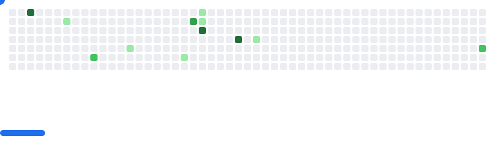

[](https://git.io/typing-svg)

<br />
<br />
<br />

<div align="center"> 

---

<!-- README-STATS:START -->

```
🕰️ I get my jam on during the daytime!

🌞 Morning  	248    commits	██████░░░░░░░░░░░░░░░░░░░░░░░░	8.04%
🌆 Daytime  	1231   commits	██████████████████████████████	39.90%
🌃 Evening  	667    commits	████████████████░░░░░░░░░░░░░░	21.62%
🌙 Night    	939    commits	██████████████████████░░░░░░░░	30.44%
```

```
📅 I'm most productive on Wednesdays!

Monday      	380    commits	███████████████████░░░░░░░░░░░	12.32%
Tuesday     	487    commits	████████████████████████░░░░░░	15.79%
Wednesday   	594    commits	██████████████████████████████	19.25%
Thursday    	442    commits	██████████████████████░░░░░░░░	14.33%
Friday      	452    commits	██████████████████████░░░░░░░░	14.65%
Saturday    	384    commits	███████████████████░░░░░░░░░░░	12.45%
Sunday      	346    commits	█████████████████░░░░░░░░░░░░░	11.22%
```

```
🧪 JavaScript for the win!

JavaScript  	72     repos	██████████████████████████████	22.64%
TypeScript  	58     repos	████████████████████████░░░░░░	18.24%
CSS         	54     repos	██████████████████████░░░░░░░░	16.98%
HTML        	47     repos	███████████████████░░░░░░░░░░░	14.78%
Shell       	16     repos	██████░░░░░░░░░░░░░░░░░░░░░░░░	5.03%
```

<!-- README-STATS:END -->

---

### **Principais Tecnologias**
[](https://skillicons.dev)

### **Tecnologias que também utilizo**

#### **Back-End**
[](https://skillicons.dev)

#### **Front-End**
[](https://skillicons.dev)

#### **Outras Tecnologias**
[](https://skillicons.dev)

---

<br />
<br />
<br />
<br />
<br />

<picture>
  <source media="(prefers-color-scheme: dark)" srcset="https://raw.githubusercontent.com/GuiCardilho/GuiCardilho/output/github-snake-dark.svg" />
  <source media="(prefers-color-scheme: light)" srcset="https://raw.githubusercontent.com/GuiCardilho/GuiCardilho/output/github-snake.svg" />
  
</picture>

<picture>
  <source
    media="(prefers-color-scheme: dark)"
    srcset="images/breakout-dark.svg"
  />
  <source
    media="(prefers-color-scheme: light)"
    srcset="images/breakout-light.svg"
  />
  
</picture>
 

